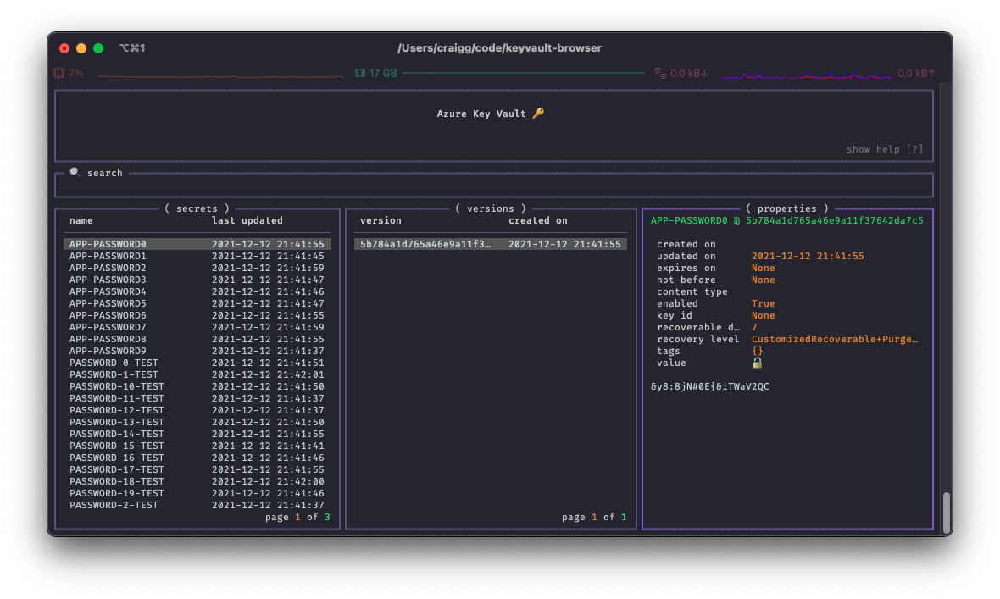

<!-- markdownlint-disable MD026 -->
# azure-keyvault-browser :lock:

 [](https://badge.fury.io/py/azure-keyvault-browser)

`azure-keyvault-browser` is a tool for browsing and searching for secrets in Azure Key Vault.

> :construction: :warning: This app is a prototype and in very early stages of development. There will be bugs, bad UX and missing functionality.



:rocket: This project is powered by [textual](https://github.com/willmcgugan/textual) and [rich](https://github.com/willmcgugan/rich)!

## Installation and Configuration

`azure-keyvault-browser` is available on [pypi.org](https://pypi.org)!

```bash
pip install azure-keyvault-browser
```

Once the app is installed you can run it from your terminal with the `kv` command.

```bash
kv
```

Alternatively, you can run the app with docker to keep your local dependencies squeaky clean 🧹

```bash
docker run --rm -it --volume $HOME:/app --volume $HOME/.azure:/root/.azure ghcr.io/chelnak/azure-keyvault-browser:latest
```

### Authentication

`azure-keyvault-browser` uses azure cli authentication. Before you use the app ensure that you have logged in and set your subscription.

```bash
az login
az account set --subscription "xxxxxxxx-xxxx-xxxx-xxxx-xxxxxxxxxxxxx"
```

### Configuration

On first run you will be asked for some information so that the app can build your configuration file.

You'll need to enter a valid Key Vault name.

Alternatively you can manually pre-load a config file at `~/azure-keyvault-browser/config.toml` and use the following schema:

```bash
# config.toml

keyvault = ""
```

## Compatibility

This project has been tested on macOS and Linux (Arch, Ubuntu 20.04 and above) with Python 3.9 installed. It will likely work on any Linux distribution where Python 3.9 or above is available.
For Ubuntu 20.04, it may be necessary to install the `python3.9` package.

## Contributing

If you would like to contribute to `azure-keyvault-browser` head over to the [contributing guide](CONTRIBUTING.md) to find out more!
